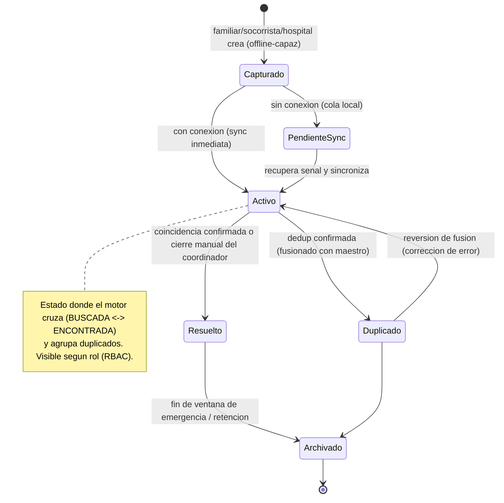
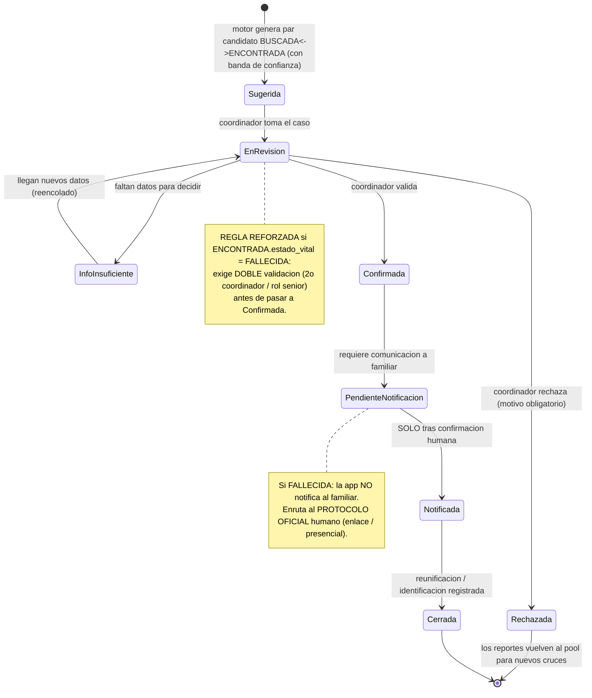
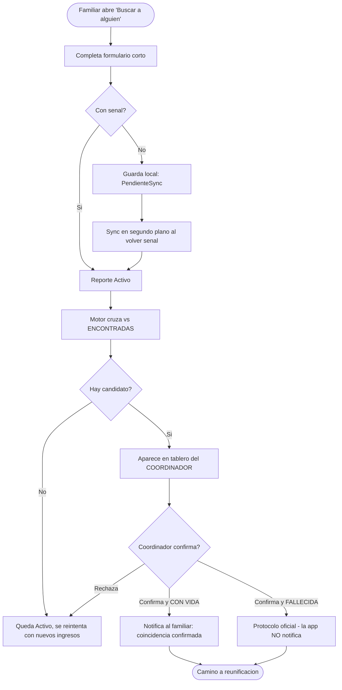
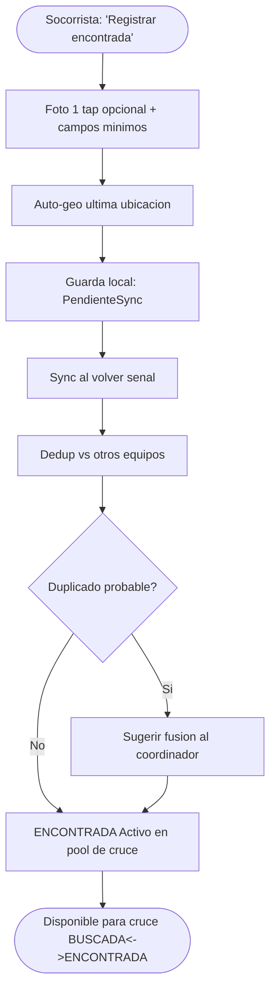
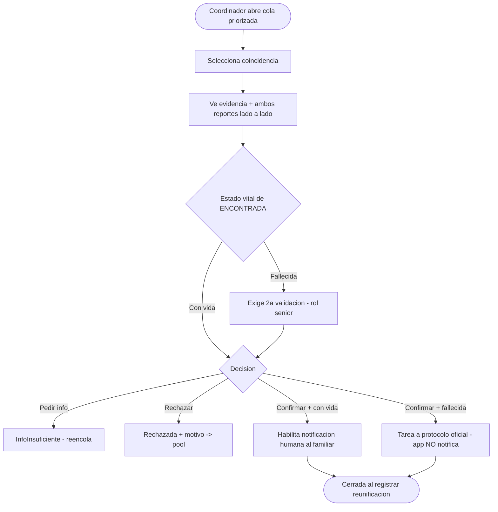

# Plan de Producto — Módulo "Reencuentro" (Personas Desaparecidas / Encontradas)

> Nuevo apartado dentro de **Hu-Mano Colombia** para reporte, cruce y reunificación de personas tras el terremoto del 10-ago-2026 (Chocó / occidente de Colombia).

| | |
|---|---|
| **Producto** | Hu-Mano Colombia (Expo / React Native / Supabase) |
| **Entregable** | Módulo nuevo dentro de la app existente — *no* un producto separado |
| **Plataforma** | **Nativa** (Expo/React Native). El "PWA" del brief queda descartado por decisión de producto |
| **Requisito duro que se mantiene** | **Offline-first** (captura en campo sin señal), **human-in-the-loop**, **PFIF**, **privacidad PII/menores** |
| **Autor** | PM (agente) · **Estado:** Borrador para revisión de Tech Lead + stakeholders |
| **Fecha** | 2026-08-12 |
| **Ventana de valor** | Máxima en los primeros días–semanas (búsqueda y reunificación). Priorizar *time-to-usefulness* sobre completitud. |

---

## 0. Resumen ejecutivo (30 segundos)

Añadimos a Hu-Mano Colombia un módulo que **cruza en tiempo casi-real tres poblaciones** que hoy nadie reconcilia: personas **BUSCADAS** (reportadas por familiares), personas **ENCONTRADAS** (rescatadas, hospitalizadas, en albergue o fallecidas) y **reportes duplicados**. El corazón no es "un formulario", es **resolución de entidades**: emparejar BUSCADA ↔ ENCONTRADA con datos parciales, mal escritos y capturados sin conexión, **sin falsos positivos que causen daño**. La IA **sugiere y prioriza; nunca anuncia**: toda coincidencia sensible pasa por **confirmación humana de un coordinador** antes de notificar a una familia. El MVP entrega captura offline, deduplicación, cruce estructurado, tablero de validación para coordinadores y notificación solo tras confirmación humana. Biometría facial y aprendizaje automático quedan **fuera del MVP**.

**Anti-objetivo declarado:** no reemplazar canales oficiales de emergencia ni inflar cifras. Interoperar (PFIF) con UNGRD, hospitales y Cruz Roja, no competir.

---

## 0.1 Nota de viabilidad técnica (respuesta a "¿alcanza el equipo/PC?")

> Esto es **insumo para el Tech Lead**, no decisión de PM. Se incluye porque condiciona el arranque.

**Capacidad del ordenador: más que suficiente.**

| Recurso | Valor | Veredicto para este desarrollo |
|---|---|---|
| CPU | Intel Core Ultra 7 155H (16 núcleos / 22 hilos) | Sobrado para Metro bundler, Supabase local, Docker |
| RAM | 32 GB (10.6 GB libres ahora) | Suficiente. Cerrar apps pesadas antes de correr un emulador Android + Metro a la vez |
| Disco | 590 GB libres de 952 GB (SSD) | Abundante (node_modules + Android SDK + imágenes ~20–40 GB) |
| SO | Windows 11 | ✅ Android + web. ❌ **iOS nativo no compila en Windows** — requiere macOS o **EAS Build** (nube). iPhone físico con Expo Go sirve para probar |
| Toolchain | node, npm, pnpm, git, docker, python ya instalados | ✅ Todo lo necesario |

**El "no tenemos entorno Expo ahora mismo" es trivial de resolver** — las dependencias aún no están instaladas (`node_modules` ausente). Arranca en minutos:

```bash
npm install
npx expo start
```

Luego probar con `w` (web) o escaneando el QR con **Expo Go** en un celular físico (no hace falta emulador).

**Únicos límites reales (ninguno es de hardware):**
1. **iOS nativo** necesita Mac o EAS Build; para probar en iPhone basta Expo Go (con matices: push notifications reales requieren *dev build*/EAS).
2. **Offline-first robusto** con fotos y cola de sincronización: `AsyncStorage` (ya usado) sirve para el MVP simple; para volumen conviene evaluar `expo-sqlite`. *(Decisión Tech Lead.)*
3. **Biometría facial** (fase posterior, fuera de MVP) querrá GPU en la nube, no este portátil. Irrelevante para el MVP.

---

## 1. Personas + Jobs To Be Done

> Basadas en §3 del brief. Marcadas como **hipótesis de persona** (aún sin entrevistas). Validar con 3+ conversaciones reales por rol antes de cerrar scope.

### 1.1 Persona A — Familiar que busca · "Lucía"

**Arquetipo:** La que revisa el celular cada 5 minutos rezando por una señal.
**Contexto:** Lucía está en Pereira; su hermano vivía en Quibdó, incomunicado desde el sismo (Chocó estuvo días sin luz ni señal). Tiene una foto vieja, sabe la ropa aproximada que usaba y su edad. Está saturada emocionalmente, alterna entre grupos de WhatsApp, llamadas a hospitales y publicaciones en redes.

- **Goals** — *Funcional:* reportar a su hermano y enterarse apenas haya una coincidencia. *Emocional:* sentir que "estoy haciendo algo", reducir la impotencia. *Social:* coordinar con el resto de la familia sin repetir el reporte 5 veces.
- **Pain points:** "Llamo a hospitales y nadie tiene una lista unificada." · "Publiqué en tres grupos y no sé si sirvió." · "Tengo miedo de recibir una noticia falsa."
- **Tecnología:** usa WhatsApp intensivamente, señal intermitente, batería crítica. Sofisticación media-baja.
- **Criterios de adopción:** reportar en < 2 min aunque no tenga todos los datos; que le avisen **solo cuando haya algo confirmado**, no falsas alarmas.
- **Actitud frente a IA:** no le importa si hay "IA"; le importa **no recibir una esperanza falsa**.
- **Lo que NO le importa:** estadísticas agregadas, mapas bonitos.

**JTBD**
```
Cuando no sé dónde está mi hermano y la información está dispersa,
quiero reportarlo rápido con lo poco que tengo y que me avisen si aparece,
para poder actuar sin vivir pegada al teléfono revisando todo manualmente.
```
```
Cuando reciba una notificación sobre él,
quiero que sea información verificada por una persona, no una suposición automática,
para no derrumbarme por una coincidencia equivocada.
```

### 1.2 Persona B — Socorrista / rescatista · "Andrés"

**Arquetipo:** El que tiene 40 segundos por persona y las manos ocupadas.
**Contexto:** Andrés (Defensa Civil) trabaja entre escombros en Quibdó. Conectividad nula o intermitente. Registra a quien encuentra mientras avanza; a veces la persona no puede identificarse (inconsciente, menor, fallecida).

- **Goals** — *Funcional:* registrar rápido a quien encuentra **sin duplicar**. *Emocional:* saber que su registro "sirvió para algo". *Profesional:* que su equipo no repita trabajo.
- **Pain points:** "Registro en papel y se pierde." · "Otro equipo registra a la misma persona." · "Sin señal, cualquier app que exija internet es inútil aquí."
- **Tecnología:** celular institucional o propio; prioriza velocidad; tolerancia cero a fricción.
- **Criterios de adopción:** **funciona 100% offline**, captura en pocos toques, foto opcional con un tap.
- **Actitud frente a IA:** neutral; quiere que "el sistema" evite duplicados, no que le haga preguntas.
- **Lo que NO le importa:** completar campos "bonitos"; quiere lo mínimo viable.

**JTBD**
```
Cuando encuentro a alguien en campo y no tengo señal,
quiero registrarlo en segundos y que se sincronice solo cuando haya red,
para no frenar el rescate ni perder el dato.
```
```
Cuando registro a alguien que quizá ya registró otro equipo,
quiero que el sistema detecte el posible duplicado,
para no inflar las cifras ni duplicar esfuerzo.
```

### 1.3 Persona C — Coordinador de reunificación · "Diana" *(rol central, no opcional)*

**Arquetipo:** La que tiene el poder — y la responsabilidad — de decir "sí, es él".
**Contexto:** Diana (Cruz Roja / enlace UNGRD) trabaja desde un Puesto de Mando con conectividad. Revisa coincidencias que el sistema le propone priorizadas. **Es el guardián del human-in-the-loop:** ninguna familia se entera sin que ella (o un par) confirme.

- **Goals** — *Funcional:* confirmar/rechazar coincidencias rápido y bien. *Emocional:* dormir tranquila sabiendo que no notificó un error. *Profesional:* dar cifras confiables a las autoridades.
- **Pain points:** "Las cifras se contradicen entre fuentes." · "No quiero ser quien le dio a una familia una noticia falsa." · "Necesito ver *por qué* el sistema sugiere esta pareja, no un número mágico."
- **Tecnología:** trabaja en pantalla, cómoda con tableros; escéptica de cajas negras.
- **Criterios de adopción:** ver la **evidencia** de cada coincidencia (qué campos coinciden), no un score crudo; poder rechazar con motivo; un flujo distinto y más estricto para fallecidos.
- **Actitud frente a IA:** "que me ayude a priorizar, pero **la decisión es mía**".

**JTBD**
```
Cuando el sistema me sugiere que una persona buscada y una encontrada son la misma,
quiero ver en qué se basa y confirmarlo o rechazarlo con criterio,
para notificar a la familia solo cuando estoy segura.
```
```
Cuando la coincidencia involucra a una persona fallecida,
quiero un proceso reforzado (segunda validación) y que la app NO notifique sola,
para que la noticia se dé por el canal humano correcto.
```

### 1.4 Personas de soporte (perfil compacto)

| Persona | Contexto | JTBD central | Nota de diseño |
|---|---|---|---|
| **Personal hospitalario** ("Marta") | Recibe heridos, algunos sin identificar (NN) | "Cargar ingresos y que se crucen con reportes de búsqueda" | Carga rápida; muchos ingresos sin datos completos |
| **Gestor de albergue** ("Óscar") | Registra a quién alberga | "Reportar personas a salvo para bajar la ansiedad de las familias" | La mayoría son ENCONTRADA con vida → reunificaciones de alto valor y bajo riesgo |

---

## 2. Lógica de negocio

Modelo de datos **único** para "Reporte de persona" con dos **tipos** sobre el mismo esquema (para que ambos lados del cruce sean comparables):

- `tipo`: `BUSCADA` | `ENCONTRADA`
- `estado_vital` (solo aplica a ENCONTRADA): `CON_VIDA` | `FALLECIDA` | `DESCONOCIDO`
- Campos: `nombre` (tolerante a variantes/apodos), `edad_aprox`, `descripcion_fisica`, `ropa`, `senas_particulares`, `ultima_ubicacion` (geo), `foto`, `datos_reportante`, `estado` (lifecycle, ver 2.1).

### 2.1 Máquina de estados — Reporte de persona



| Estado | Quién lo ve | Acciones | Reglas |
|---|---|---|---|
| Capturado | Creador (local) | Editar, enviar | Vive en el dispositivo; no exige red |
| PendienteSync | Creador | Ver estado de cola | Reintenta sync en segundo plano; nunca se pierde |
| Activo | Coordinador + creador (según RBAC) | Participa en cruce/dedup | Único estado donde corre el matching |
| Duplicado | Coordinador | Ver maestro, revertir | Reversible + auditado (afecta cifras oficiales) |
| Resuelto | Coordinador + involucrados | Ver cierre | Requiere match confirmado o motivo de cierre manual |
| Archivado | Admin | Ver (retención) | Sujeto a política de retención (ver §8) |

### 2.2 Máquina de estados — Coincidencia (match) · núcleo del human-in-the-loop



| Estado | Quién lo ve | Acciones | Reglas |
|---|---|---|---|
| Sugerida | Coordinador | Tomar caso | Ordenada por banda de confianza; nunca visible a familiares |
| EnRevisión | Coordinador (dueño del caso) | Confirmar, rechazar, pedir info | Fallecidos → doble validación obligatoria |
| InfoInsuficiente | Coordinador | Reactivar al llegar datos | No cierra el caso; lo aparca |
| Rechazada | Coordinador | Ver motivo | Reportes regresan al pool; se registra el rechazo |
| Confirmada | Coordinador + par validador | Ver evidencia | Con vida → habilita notificación; Fallecida → protocolo oficial |
| Notificada | Coordinador | Ver acuse | Solo tras acción humana explícita |
| Cerrada | Coordinador + involucrados | Ver cierre | North star: reunificación confirmada |

### 2.3 Regla de presentación de confianza (no exponer score crudo)

El coordinador **nunca** ve un número como "0.83". Ve **tres bandas + evidencia**:

| Banda (etiqueta de UI) | Significado interno | Lenguaje permitido | Prohibido |
|---|---|---|---|
| **Revisión prioritaria** | Alta similitud | "Coincidencia probable para revisar" | "Encontrado", "es él/ella" |
| **Posible coincidencia** | Similitud media | "Posible coincidencia" | Cualquier certeza |
| **Baja prioridad** | Similitud baja | "Coincidencia débil" | — |

Junto a la banda se muestran **chips de evidencia**: qué coincidió (nombre fonético, edad ±tolerancia, proximidad geográfica, ropa, señas) y un texto "por qué se sugiere". **La banda ordena la cola; la evidencia sustenta la decisión humana.**

### 2.4 Reglas de validación (extracto)

```
ENTIDAD: Reporte · CAMPO: nombre
REGLA: Identificabilidad mínima
CONDICION: al crear cualquier reporte
RESTRICCION: al menos 2 de {nombre, edad_aprox, ultima_ubicacion, foto, señas}
MENSAJE: "Agrega al menos un dato más para poder cruzar este reporte."
BLOQUEA?: No en captura offline (se guarda igual) — Sí para pasar a 'Activo' con prioridad de cruce
```
```
ENTIDAD: Reporte(BUSCADA) · CAMPO: datos_reportante
REGLA: Canal de aviso
CONDICION: tipo = BUSCADA
RESTRICCION: al menos un medio de contacto (para poder notificar)
MENSAJE: "¿Cómo te avisamos si aparece? (WhatsApp o teléfono)"
BLOQUEA?: No (advertencia); sin contacto no hay notificación posible
```
```
ENTIDAD: Reporte · CAMPO: foto (menor de edad)
REGLA: Protección de menores
CONDICION: edad_aprox < 18
RESTRICCION: foto y PII con acceso restringido por rol; no exposición pública
MENSAJE: "Este reporte es de un menor: su información tiene acceso restringido."
BLOQUEA?: N/A (control de visibilidad, no de guardado)
```

---

## 3. Flujos de usuario

### 3.1 Flujo — Familiar reporta BUSCADA y recibe aviso

**Objetivo:** reportar en < 2 min y enterarse solo de coincidencias confirmadas.
**Precondiciones:** app instalada; puede no haber señal.
**Entry points:** tab "Reencuentro" → "Buscar a alguien"; banner de emergencia en el feed.

**Happy path**
1. Lucía toca "Buscar a alguien".
2. Sistema muestra formulario corto (nombre, edad aprox., última ubicación, foto opcional, ropa/señas, tu contacto).
3. Lucía completa lo que sabe (sin foto) y envía.
4. Con señal → reporte pasa a `Activo`; sin señal → `PendienteSync` (cola local) con aviso "Se enviará al recuperar conexión".
5. El motor cruza contra ENCONTRADAS; si hay candidatos, aparecen en el tablero del **coordinador** (no de Lucía).
6. Un coordinador confirma una coincidencia (con vida).
7. Sistema notifica a Lucía: *"Hay una coincidencia confirmada para tu reporte. Un coordinador se comunicará contigo."* (lenguaje sin falsa certeza total).
8. **Resultado:** match `Notificada` → camino a reunificación.

**Edge cases**
- **Sin señal (E1):** todo el flujo de captura funciona; la cola sincroniza sola. El usuario ve el estado "pendiente".
- **Datos parciales (E2):** se acepta; el reporte entra con menor prioridad de cruce y advertencia amable de "agrega más datos para mejorar la búsqueda".
- **Foto ausente (E3):** permitido (biometría no es MVP). Cruce estructurado igual opera.
- **Coincidencia con fallecido (E4):** **la app no le notifica a Lucía**; el caso entra al protocolo oficial (doble validación + comunicación humana). Ver 3.3.
- **Duplicado por varios familiares (E5):** el sistema agrupa los reportes BUSCADA de la misma persona (dedup) y unifica el aviso.



### 3.2 Flujo — Socorrista registra ENCONTRADA en campo (offline)

**Objetivo:** registrar en segundos sin duplicar, sin señal.
**Entry points:** tab "Reencuentro" → "Registrar encontrada".

**Happy path**
1. Andrés toca "Registrar encontrada".
2. Formulario ultra-corto: foto (1 tap, opcional), sexo, edad aprox., ubicación (auto-geo), estado vital, ropa/señas.
3. Envía → como no hay señal, queda en `PendienteSync`.
4. Al recuperar red, sincroniza; el motor detecta posibles duplicados con otros equipos y posibles cruces con BUSCADAS.
5. **Resultado:** ENCONTRADA `Activo`, entra al pool de cruce.

**Edge cases**
- **Sin señal (E1):** núcleo del caso — captura y cola local obligatorias.
- **Persona no identificada / NN (E2):** se registra con lo observable (ropa, señas, foto); nombre vacío permitido.
- **Fallecida (E3):** `estado_vital = FALLECIDA`; el cruce que la involucre activará el protocolo reforzado.
- **Duplicado entre equipos (E4):** dedup sugiere fusión; conteos no se inflan.
- **Batería/tiempo (E5):** el formulario debe completarse en pocos toques; foto opcional.



### 3.3 Flujo — Coordinador revisa y valida coincidencias (tablero)

**Objetivo:** confirmar/rechazar con evidencia; blindar el caso de fallecidos.
**Precondiciones:** rol Coordinador (RBAC); conexión (el tablero vive en servidor).
**Entry points:** tab "Coordinación" → cola priorizada.

**Happy path**
1. Diana ve la cola ordenada por banda (Revisión prioritaria arriba).
2. Abre una coincidencia; ve **evidencia** (chips: nombre fonético, edad, geo, ropa) y ambos reportes lado a lado.
3. Decide: **Confirmar** / **Rechazar (motivo)** / **Pedir más info**.
4. Si confirma (con vida) → habilita notificación al familiar (acción humana explícita).
5. **Resultado:** match `Confirmada` → `Notificada` → `Cerrada` al registrar reunificación.

**Edge cases**
- **Info insuficiente (E1):** aparca el caso (`InfoInsuficiente`); reingresa al llegar datos.
- **Coincidencia con fallecido (E2):** requiere **doble validación** (2º coordinador/rol senior). La app **no** notifica al familiar; genera tarea para el **protocolo oficial** (enlace humano / Medicina Legal).
- **Conflicto (E3):** dos BUSCADAS distintas reclaman la misma ENCONTRADA → el sistema las presenta juntas; el coordinador resuelve prioridad; ninguna se auto-confirma.
- **Coordinador sin señal (E4):** el tablero degrada a **solo-lectura** de lo ya sincronizado; ninguna confirmación se envía hasta recuperar red (evita decisiones sobre datos desactualizados).



---

## 4. Especificación de la feature de IA

> El PM define **qué** hace la IA, cuándo entra el humano y el fallback. El **cómo** (modelo, umbrales exactos) es del Tech Lead / ML Engineer.

### 4.1 Qué decide / genera la IA

Dos usos del **mismo motor de resolución de entidades**:
1. **Cruce** BUSCADA ↔ ENCONTRADA → propone **pares candidatos priorizados por banda**.
2. **Deduplicación** → agrupa reportes del mismo tipo que son la misma persona.

La IA **sugiere y prioriza; no anuncia**.

### 4.2 Nivel de autonomía

| Caso | Autonomía | Justificación |
|---|---|---|
| Cruce BUSCADA↔ENCONTRADA (con vida) | **Sugerencia** → confirma coordinador | Alto costo de error emocional |
| Cruce con **fallecido** | **Asistencia + doble validación** | Máximo costo de error; irreversible emocionalmente |
| Dedup casi-exacto (banda muy alta) | **Auto-fusión reversible + auditada** | Bajo riesgo, alto valor operativo; siempre revertible |
| Dedup dudoso | **Sugerencia** → confirma coordinador | Afecta cifras oficiales |

**Regla no negociable:** ninguna coincidencia sensible se comunica a una familia de forma automática. **Todo cruce pasa por confirmación humana.**

### 4.3 Inputs / Outputs

| Input al motor | Fuente | Nota |
|---|---|---|
| nombre normalizado (fonética adaptada al español, no Soundex) | Reporte | Tolerante a acentos, apodos, errores |
| edad_aprox (con tolerancia) | Reporte | Rango, no valor exacto |
| ubicación (proximidad geo) | Reporte / geo dispositivo | |
| sexo, ropa, señas (texto) | Reporte | Señales secundarias |
| ~~embeddings faciales~~ | Foto | **Fuera de MVP** (fase posterior) |

| Output | Uso | Validación |
|---|---|---|
| Lista priorizada de pares con **banda** + **evidencia** | Alimenta cola del coordinador | La decide un humano |
| Grupos de duplicados | Sugerencia de fusión | Reversible |

### 4.4 Human-in-the-loop y fallback

| Situación | Comportamiento |
|---|---|
| **No hay coincidencia** | Reporte queda `Activo`; se reintenta con cada nuevo ingreso. Búsqueda/cruce **manual** disponible para el coordinador |
| **Baja confianza** | Va a cola de **baja prioridad** — nunca se descarta en silencio ni se auto-notifica |
| **Motor/API caído** | La **captura sigue** (offline); el cruce se reintenta al restablecer. Banner de estado; nunca bloquea el flujo de campo |
| **Timeout** | Degrada a cola manual; se avisa al coordinador |
| **Fallecido** | Doble validación + protocolo oficial; la app no notifica al familiar |

### 4.5 Datos, privacidad y feedback

- **Minimización:** solo campos necesarios para el cruce y el contacto.
- **PII / menores:** acceso por rol (RBAC); fotos y datos de menores restringidos; sin exposición pública.
- **Retención:** limitada a la ventana de emergencia (propuesta: **90 días**, revisable con marco legal — ver §8).
- **Feedback loop:** se **registran** confirmaciones/rechazos del coordinador (auditoría + mejora futura). **Sin aprendizaje automático en línea en el MVP** (fase posterior).
- **Anti-patrón evitado:** especificar la IA "como si siempre acertara". El flujo de error y el de "coincidencia rechazada" son parte del producto, no un extra.

---

## 5. Alcance del MVP (priorización explícita)

### 5.1 MoSCoW

**🔴 Must Have** (sin esto no hay valor)

| Feature | Justificación | Talla |
|---|---|---|
| Captura BUSCADA/ENCONTRADA **offline** (cola local + sync + foto comprimida en dispositivo) | Núcleo del uso en campo (Chocó sin señal) | L |
| Modelo de datos único (2 tipos, mismo esquema) | Hace comparables ambos lados del cruce | S |
| **Deduplicación** (sugerida; auto-fusión reversible solo casi-exactos) | Evita inflar cifras; §8 | M |
| **Cruce estructurado** BUSCADA↔ENCONTRADA (fonética ES + edad + geo) | Corazón del valor | L |
| **Tablero de matching** del coordinador (revisar/confirmar/rechazar con evidencia) | Human-in-the-loop | L |
| Bandas de confianza + evidencia (sin score crudo) | Decisión humana informada | M |
| Notificación al familiar **solo tras confirmación humana** | Regla no negociable | M |
| **Protocolo especial de fallecidos** (doble validación + no-notificación automática) | Máximo costo de error | M |
| **RBAC** básico (familiar / socorrista / hospital / albergue / coordinador) | Seguridad de PII | M |
| **Interoperabilidad PFIF** (export/import básico) | Requisito, no nice-to-have (§7) | M |

**🟡 Should Have** (hay workaround)

| Feature | Workaround | Talla |
|---|---|---|
| Búsqueda/cruce **manual** por el coordinador | El cruce automático cubre lo principal | M |
| Audit trail visible (quién hizo qué) | Logs internos bastan al inicio | S |
| Tablero de **conteos** (buscadas/encontradas/reunificadas) | Consultas manuales al inicio; **ojo: alimenta cifras oficiales** | M |

**🟢 Could Have**

| Feature | Valor | Talla |
|---|---|---|
| Filtros avanzados en cola | Poco volumen al arranque | S |
| Export CSV para reportes internos | PFIF ya cubre intercambio | S |

**⬛ Won't Have (ahora)**

| Feature | Por qué no | Revisitar |
|---|---|---|
| **Reconocimiento facial / biometría** | Alto costo, riesgo, no crítico para arrancar | Fase 3 |
| **Feedback loop de aprendizaje automático** | Requiere volumen y proceso de gobernanza | Fase 3 |
| Integraciones avanzadas más allá de PFIF | Complejidad sin validar | Tras piloto |
| App/plataforma separada | Ya vive dentro de Hu-Mano | — |

### 5.2 RICE para features en disputa

| Feature | Reach | Impact | Confidence | Effort (pm) | RICE |
|---|---|---|---|---|---|
| Cruce estructurado | Alto | 3 | 80% | 2 | **alto** |
| Tablero coordinador | Medio (pocos coord.) | 3 | 90% | 1.5 | **alto** |
| Biometría facial | Medio | 2 | 50% | 4 | **bajo** → fase posterior |
| Tablero de conteos | Medio | 1 | 70% | 1 | medio → Should |

### 5.3 Roadmap por outcomes

**Fase 0 — Discovery & Setup (días 1–3, comprimido por emergencia)**
Objetivo: alinear dominio y arrancar entorno.
- [ ] Personas validadas (mín. 1 conversación por rol crítico dado el tiempo).
- [ ] Confirmar marco legal de datos (Ley 1581) y protocolo de fallecidos con Cruz Roja/UNGRD/Medicina Legal.
- [ ] Entorno Expo corriendo (`npm install` + `npx expo start`), esquema PFIF en Supabase.

**Fase 1 — MVP "Reencuentro" (arranque rápido)**
Objetivo de usuario: *un familiar reporta offline y un coordinador confirma coincidencias sin falsos positivos.*
Hipótesis: el cruce estructurado + validación humana produce reunificaciones reales sin daño.
Exit criteria:
- [ ] Un familiar y un socorrista completan su flujo **sin conexión** y sincroniza al 100% en prueba.
- [ ] Un coordinador confirma/rechaza desde el tablero con evidencia.
- [ ] **0 falsos positivos confirmados** en el piloto.
- [ ] Export PFIF válido contra un esquema de referencia.
- [ ] Sin bugs P0 abiertos.

**Fase 2 — Consolidación**
Objetivo: robustez y visibilidad. Cruce/búsqueda manual, audit trail, tablero de conteos, mejoras de dedup.
Exit: cifras conciliables con fuentes oficiales; latencia de sync aceptable bajo carga.

**Fase 3 — Expansión** (tras validar Fase 1)
Biometría facial (umbral conservador), feedback loop con gobernanza, integraciones ampliadas.

---

## 6. Métricas de éxito

### 6.1 North Star

**Reunificaciones confirmadas** (con vida) — acumuladas y por día. Captura el momento "aha" real del producto: una familia reencontrada.

### 6.2 Métricas de soporte

| Métrica | Definición | Target | Alarma |
|---|---|---|---|
| Tiempo reporte → coincidencia confirmada (mediana) | de `Capturado` a `Confirmada` | Bajar semana a semana | — |
| Precisión de deduplicación | dups correctos / dups sugeridos | > 90% | < 75% |
| **Falsos positivos confirmados** (KPI de seguridad crítico) | matches confirmados y luego resultaron erróneos | **0** | > 0 → revisión inmediata |
| Cobertura offline | reportes capturados sin señal y sincronizados con éxito | > 95% sync exitosa | < 85% |

### 6.3 Salud de la IA (dashboard operativo)

| Métrica | Target | Alarma |
|---|---|---|
| Tasa de confirmación de sugerencias (por banda) | Coherente con la banda | Prioritaria con baja confirmación |
| Tasa de rechazo | Monitoreada | Pico súbito |
| Tasa de fallback (motor no disponible) | < 2% | > 10% |
| Latencia de sync (P95) | Aceptable en red intermitente | Definir con Tech Lead |

**Segmentar** precisión por: tipo de caso, región, con/sin foto, con/sin vida (un promedio puede esconder un 50% en el segmento más crítico).

### 6.4 Plan de tracking (eventos clave)

```
report_created { report_id, tipo, offline:boolean, campos_completos:int, es_menor:boolean, ts }
report_synced { report_id, tiempo_en_cola_seg, ts }
duplicate_merged { master_id, merged_id, auto:boolean, banda, ts }
match_suggested { match_id, banda, evidencia[], estado_vital, ts }
match_reviewed { match_id, accion: confirmed|rejected|need_info, motivo?, doble_validacion:boolean, ts, coordinador_id }
family_notified { match_id, canal, ts }        // solo tras confirmación humana
case_closed { match_id, resultado: reunificacion|identificacion, ts }
```

---

## 7. Criterios de aceptación (testeables)

**Captura offline**
- [ ] DADO un dispositivo **sin señal**, CUANDO el usuario crea un reporte, ENTONCES se guarda local como `PendienteSync` y se muestra "se enviará al recuperar conexión".
- [ ] DADO reportes en cola, CUANDO se recupera la conexión, ENTONCES sincronizan **automáticamente** y pasan a `Activo` sin acción del usuario.
- [ ] DADO que se adjunta una foto, CUANDO se guarda, ENTONCES la foto se **comprime en el dispositivo** antes de encolar.

**Deduplicación**
- [ ] DADO dos ENCONTRADAS casi idénticas, CUANDO se sincronizan, ENTONCES el sistema sugiere fusión y, si la banda es muy alta, la **auto-fusiona de forma reversible y auditada**.
- [ ] DADO una fusión, CUANDO el coordinador la revierte, ENTONCES ambos reportes vuelven a existir por separado y queda registro.

**Cruce y bandas**
- [ ] DADO una BUSCADA y una ENCONTRADA compatibles, CUANDO corre el motor, ENTONCES aparece una coincidencia `Sugerida` con **banda** y **evidencia**, visible **solo** para el coordinador.
- [ ] DADO cualquier coincidencia, CUANDO el coordinador la abre, ENTONCES **no** ve un score numérico crudo, sino banda + chips de evidencia.

**Human-in-the-loop**
- [ ] DADO una coincidencia `Sugerida`, CUANDO **no** hay confirmación humana, ENTONCES el familiar **no** recibe ninguna notificación.
- [ ] DADO una coincidencia confirmada **con vida**, CUANDO el coordinador ejecuta la acción de notificar, ENTONCES el familiar recibe un mensaje **sin lenguaje de certeza absoluta**.

**Fallecidos (blindaje)**
- [ ] DADO una ENCONTRADA `FALLECIDA`, CUANDO un coordinador intenta confirmar, ENTONCES el sistema **exige una segunda validación** antes de permitir `Confirmada`.
- [ ] DADO una coincidencia confirmada con fallecido, CUANDO se cierra la validación, ENTONCES la app **no notifica** al familiar y genera una **tarea para el protocolo oficial**.

**Interoperabilidad**
- [ ] DADO el conjunto de reportes, CUANDO se exporta, ENTONCES el archivo cumple el esquema **PFIF** y es importable por un sistema de referencia.

**Seguridad / RBAC**
- [ ] DADO un usuario con rol familiar, CUANDO intenta abrir el tablero de coordinación, ENTONCES el sistema lo **deniega**.
- [ ] DADO un reporte de menor, CUANDO lo consulta un rol sin permiso, ENTONCES la PII/foto **no** se muestra.

---

## 8. Riesgos y ética

| Riesgo | Prob. | Impacto | Mitigación |
|---|---|---|---|
| **Falso positivo con fallecido** | Media | Crítico | Human-in-the-loop + doble validación + no-notificación automática + protocolo oficial |
| Duplicados inflando cifras oficiales | Alta | Alto | Dedup con reversión + auditoría; cifras marcadas como "en conciliación" |
| Fuga de PII (menores) en contexto caótico | Media | Alto | RBAC, minimización, restricción de menores, retención limitada |
| Falsa esperanza / falsa certeza por lenguaje de UI | Alta | Alto | Guía de copy: nunca "encontrado" antes de confirmar; "posible coincidencia en revisión" |
| Interferir con canales oficiales | Media | Alto | Directorio oficial visible (ya existe en la app); mensajes que derivan a líneas 123/132/144 |
| Dependencia de conectividad | Alta | Alto | Offline-first no negociable en captura |

**Marco legal (Colombia):** Ley 1581 de 2012 (habeas data / protección de datos), protección reforzada de datos de **menores**; identificación de **fallecidos** compete a **Medicina Legal (INMLCF)** — el módulo *sugiere*, no *dictamina* identificación forense. *(Confirmar con jurídico + stakeholders.)*

---

## 9. Interoperabilidad (PFIF) — requisito de día uno

- Adoptar **PFIF** (People Finder Interchange Format, usado por Google Person Finder) como esquema de intercambio desde el MVP.
- Objetivo: intercambiar datos con **UNGRD**, hospitales, y la iniciativa **Restoring Family Links** de la Cruz Roja (ICRC).
- Mapear el "Reporte de persona" ↔ registros PFIF (`person` / `note`), incluyendo estado de coincidencia.
- Evaluar **HXL** si se conecta con coordinación de ayuda más amplia. *(Insumo Tech Lead.)*

---

## 10. Decisiones pendientes (para Tech Lead / stakeholders)

> Marcadas como **insumo**, no mandato de PM.

| # | Decisión | Dueño | Nota |
|---|---|---|---|
| 1 | Almacenamiento offline: `AsyncStorage` (ya usado) vs `expo-sqlite` para cola + fotos | Tech Lead | Volumen y robustez de sync |
| 2 | Motor de linkage (candidato mencionado en discovery: Fellegi-Sunter) y fonética española | ML Engineer | No fijar aún; el PM solo pide 3 bandas + evidencia |
| 3 | Umbrales/cortes de cada banda de confianza | ML + Coordinación | Calibrar con datos reales; conservador para fallecidos |
| 4 | Dónde corre el cruce en Supabase (pg_trgm / unaccent / fuzzystrmatch, Edge Functions) | Tech Lead | El repo ya trae skill de buenas prácticas Postgres |
| 5 | Retención exacta (propuesta 90 días) y borrado | Jurídico + Stakeholders | Ley 1581; datos de menores |
| 6 | Protocolo oficial de notificación de fallecidos (quién, cómo, con Medicina Legal) | UNGRD / Cruz Roja | Define el "no la app" del flujo 3.3 |
| 7 | iOS: EAS Build (nube) vs solo Android + Expo Go al inicio | Tech Lead | Windows no compila iOS nativo |
| 8 | Biometría (candidato ArcFace/InsightFace) para Fase 3 | ML Engineer | Fuera de MVP; umbral conservador |

---

## 11. Glosario

| Término | Definición en este producto |
|---|---|
| **BUSCADA** | Persona reportada como desaparecida por un familiar |
| **ENCONTRADA** | Persona rescatada, hospitalizada, en albergue o fallecida |
| **Resolución de entidades / record linkage** | Determinar que dos reportes son la misma persona |
| **Deduplicación** | Agrupar reportes del mismo tipo que son la misma persona |
| **Coincidencia (match)** | Par candidato BUSCADA↔ENCONTRADA propuesto por el motor |
| **Banda de confianza** | Nivel cualitativo (prioritaria / posible / baja) que reemplaza el score crudo |
| **Human-in-the-loop (HITL)** | Un humano confirma antes de cualquier comunicación sensible |
| **NN** | Persona no identificada |
| **PFIF** | People Finder Interchange Format (estándar de intercambio) |
| **RFL** | Restoring Family Links (Cruz Roja / ICRC) |
| **RBAC** | Control de acceso basado en roles |
| **Offline-first** | La captura funciona sin conexión; sincroniza al recuperar señal |

---

*Fuentes de referencia citables: PFIF, Google Person Finder, ICRC Restoring Family Links, HXL. Este módulo interopera con la respuesta oficial; no la reemplaza.*
