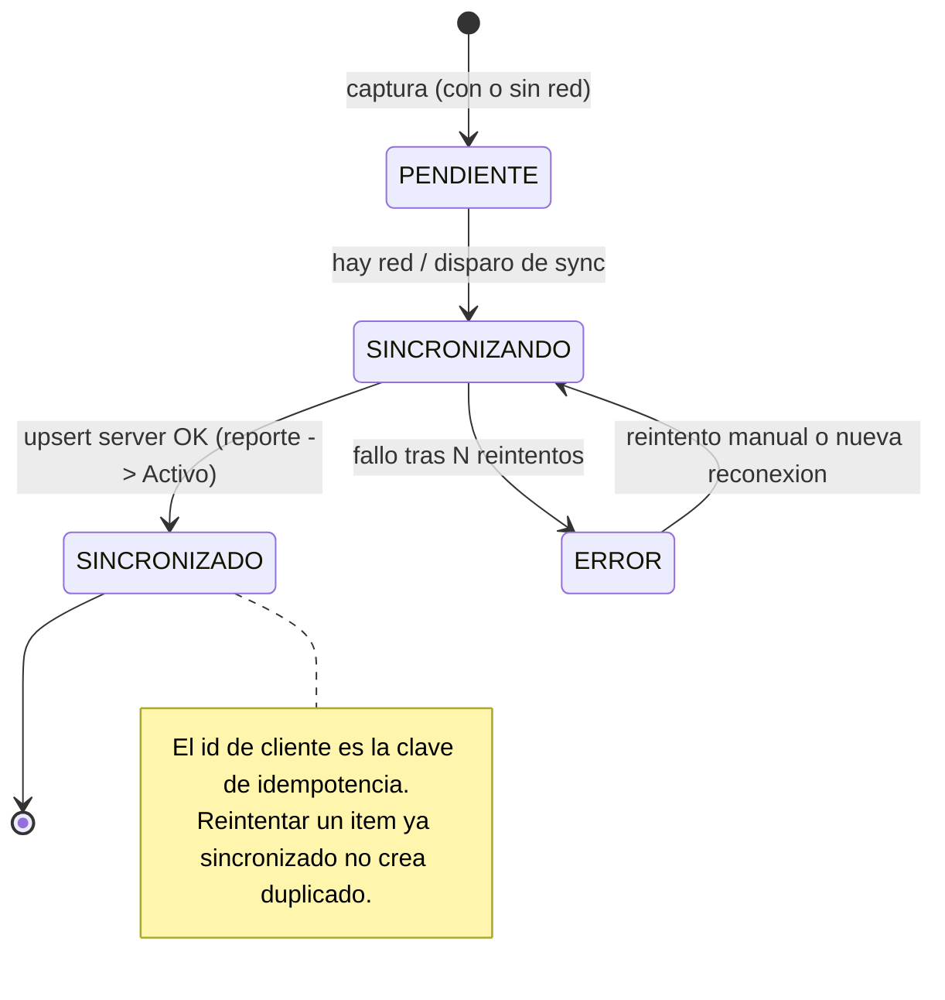
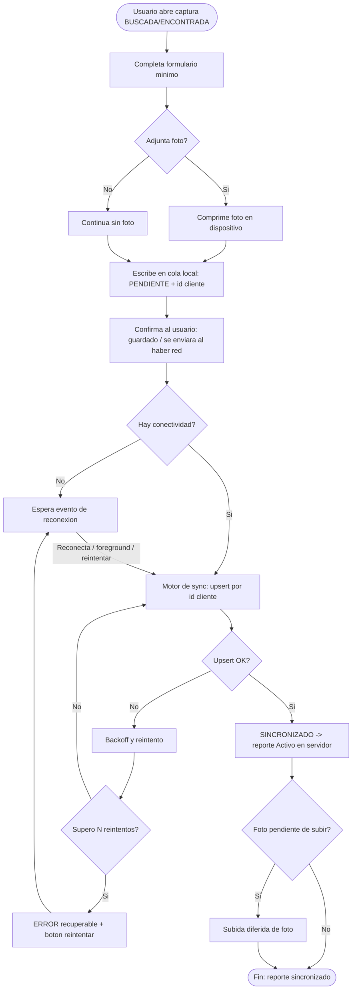

# PRD — Captura Offline + Sincronización (Módulo Reencuentro)

| | |
|---|---|
| **Versión** | 1.0 · Borrador para revisión de Tech Lead |
| **Feature** | Captura de reportes de persona (BUSCADA/ENCONTRADA) **offline** con cola local y sincronización en segundo plano |
| **Módulo** | Reencuentro (dentro de Hu-Mano Colombia — Expo/React Native/Supabase) |
| **Autor** | PM (agente) · **Fecha:** 2026-08-12 |
| **Depende de** | Ola 0 (tipos de dominio, esquema Supabase, harness de test) — ver `roadmap-y-orquestacion.md` |
| **Plataforma de despliegue** | **Android** (por ahora) |

---

## 1. Resumen ejecutivo

Un familiar o un socorrista debe poder **registrar a una persona en segundos, sin conexión**, y que ese reporte **no se pierda** y **se sincronice solo** al recuperar señal. Es el cimiento del módulo: sin captura offline confiable no hay datos que cruzar. Incluye el formulario mínimo, la **cola local durable**, el **motor de sincronización idempotente** y la **compresión de foto en el dispositivo**. **No** incluye el cruce/matching ni el tablero del coordinador (features separadas).

---

## 2. Contexto y problema

El Chocó estuvo días sin energía ni señal celular. La captura en campo (socorristas entre escombros) y de familiares en zonas golpeadas ocurre **sin conectividad**. Hoy los reportes viven en papel, memoria y grupos de WhatsApp, y se pierden o se duplican. Si la app exige internet para registrar, es inútil justo donde más se necesita.

**La app ya opera offline para "necesidades"** (`src/services/storage.ts` usa `AsyncStorage` con merge contra Supabase). Reutilizamos ese patrón, pero elevamos las garantías: aquí **perder un reporte no es una molestia, es una persona que no se busca**.

---

## 3. Usuarios objetivo

| Persona | Relación con esta feature |
|---|---|
| **Andrés** (socorrista) | Usuario principal en captura ENCONTRADA offline; máxima presión de tiempo |
| **Lucía** (familiar) | Captura BUSCADA, posiblemente sin señal, con datos parciales |
| **Marta** (hospital) | Carga de ingresos ENCONTRADA (a veces NN) |
| **Óscar** (albergue) | Registra ENCONTRADA con vida |

---

## 4. Objetivos y métricas

| Objetivo | Métrica | Baseline | Target |
|---|---|---|---|
| No perder reportes capturados sin señal | % reportes offline sincronizados con éxito | N/A | **> 99%** |
| Captura rápida en campo | Tiempo medio de captura ENCONTRADA (foto opcional) | N/A | < 45 s |
| Sync no intrusiva | % capturas que bloquean al usuario esperando red | — | **0%** |
| Idempotencia | Duplicados creados por reintentos de sync | — | **0** |

---

## 5. Scope

### ✅ Incluido
- Formulario de captura BUSCADA y ENCONTRADA (esquema único, `tipo` como atributo).
- **Cola local durable**: cada captura crea de inmediato un registro local con id estable de cliente y `sync_state`.
- **Motor de sync idempotente**: upsert por id de cliente; reintentos con backoff; disparos por reconexión, foreground y "reintentar" manual.
- **Compresión de foto en dispositivo** antes de encolar; la subida de la foto puede ir detrás del registro de texto.
- Indicadores de estado por reporte (Pendiente / Sincronizando / Sincronizado / Error).
- Registro entra al pool con estado de dominio `Activo` tras sincronizar (habilita cruce — feature aparte).

### ❌ Excluido (out of scope)
- Cruce/matching BUSCADA↔ENCONTRADA — Razón: feature separada (Ola 2).
- Tablero del coordinador y notificaciones a familiares — Razón: dependen del matching.
- Deduplicación — Razón: corre en servidor tras la sync (Ola 2).
- Biometría facial — Razón: fase posterior.

### 🔄 Decisiones pendientes (Tech Lead)
- Almacenamiento de la cola: `AsyncStorage` (patrón actual) vs `expo-sqlite`. Recomendación PM: SQLite si el volumen/fotos lo justifica. **Deadline:** antes de Ola 1.
- Librería de conectividad (p. ej. `@react-native-community/netinfo`) y de compresión (`expo-image-manipulator`). **Dueño:** DevOps.
- Bucket de fotos en Supabase Storage y su política de acceso (RBAC). **Dueño:** Backend.

---

## 6. User stories

### H1 — Capturar sin señal (socorrista)
**Como** socorrista en campo sin conexión, **quiero** registrar a una persona encontrada en segundos, **para** no frenar el rescate ni perder el dato.
**Prioridad:** Must · **Talla:** M

**Criterios de aceptación**
- [ ] DADO el dispositivo **sin conexión**, CUANDO envío el formulario, ENTONCES el reporte se guarda local con `sync_state = PENDIENTE` y veo "Se enviará al recuperar conexión".
- [ ] DADO que no adjunto foto, CUANDO guardo, ENTONCES el reporte se crea igual (foto opcional).
- [ ] DADO que la app se cierra tras capturar, CUANDO la reabro, ENTONCES el reporte pendiente **sigue en la cola** (durabilidad).

### H2 — Sincronización automática y no intrusiva
**Como** usuario, **quiero** que mis reportes pendientes se envíen solos al volver la señal, **para** no tener que acordarme de reintentar.
**Prioridad:** Must · **Talla:** L

**Criterios de aceptación**
- [ ] DADO reportes `PENDIENTE`, CUANDO se recupera conexión, ENTONCES pasan a `SINCRONIZANDO` y luego `SINCRONIZADO` sin acción del usuario.
- [ ] DADO un fallo de red a mitad de sync, CUANDO reintenta, ENTONCES **no se crean duplicados** (upsert por id de cliente).
- [ ] DADO varios reportes en cola, CUANDO uno falla, ENTONCES los demás **siguen sincronizando** (fallo aislado por ítem).
- [ ] DADO un ítem que falla N veces, CUANDO se agota el backoff, ENTONCES queda en `ERROR` con opción "reintentar" y **nunca se descarta**.

### H3 — Compresión de foto en el dispositivo
**Como** usuario en red intermitente, **quiero** que la foto se comprima antes de subir, **para** que la sync funcione con poco ancho de banda.
**Prioridad:** Must · **Talla:** M

**Criterios de aceptación**
- [ ] DADO que adjunto una foto, CUANDO se encola, ENTONCES se comprime en el dispositivo (target ≤ ~200 KB, lado mayor ≤ ~1280 px).
- [ ] DADO que el registro de texto ya sincronizó, CUANDO la foto aún sube, ENTONCES el reporte es usable y la foto se asocia al completar (subida diferida no bloquea).

### H4 — Visibilidad del estado
**Como** usuario, **quiero** ver el estado de cada reporte, **para** confiar en que llegó.
**Prioridad:** Should · **Talla:** S

**Criterios de aceptación**
- [ ] DADO reportes en distintos estados, CUANDO abro "Mis reportes", ENTONCES veo un distintivo Pendiente/Sincronizando/Sincronizado/Error por ítem.

---

## 7. Lógica de negocio

### 7.1 Estados de sincronización (subconjunto del ciclo de vida del reporte)



### 7.2 Reglas de captura y cola

```
REGLA: Id estable de cliente
CONDICION: al crear cualquier reporte
RESTRICCION: se genera un id (UUID) en el dispositivo; es la clave de idempotencia y no cambia al sincronizar
NOTA: el patrón actual usa `need-${Date.now()}-${random}`; para sync idempotente usar UUID v4

REGLA: Durabilidad
CONDICION: reporte con sync_state != SINCRONIZADO
RESTRICCION: persiste localmente hasta confirmar sync; sobrevive cierre/kill de la app

REGLA: No bloqueo
CONDICION: al capturar
RESTRICCION: la escritura local es la que confirma al usuario; la red nunca bloquea la captura

REGLA: Backoff de reintentos
CONDICION: fallo de sync de un ítem
RESTRICCION: reintentos con backoff exponencial (p. ej. 2s,4s,8s… tope); tras tope -> ERROR (recuperable)

REGLA: Aislamiento de fallos
CONDICION: sync de la cola
RESTRICCION: el fallo de un ítem no detiene la sync de los demás
```

### 7.3 Validaciones (no bloquean la captura offline)

```
CAMPO: identificabilidad mínima
RESTRICCION: al menos 2 de {nombre, edad_aprox, ultima_ubicacion, foto, señas}
BLOQUEA?: No en captura (se guarda); sí marca "prioridad de cruce baja"
MENSAJE: "Agrega al menos un dato más para mejorar la búsqueda."
```
```
CAMPO: datos_reportante (solo BUSCADA)
RESTRICCION: al menos un contacto (WhatsApp/teléfono) — reutilizar formatWhatsAppNumber()
BLOQUEA?: No (advertencia): sin contacto no hay canal de aviso
```
```
CAMPO: menor de edad (edad_aprox < 18)
RESTRICCION: marca el registro como sensible (acceso restringido por RBAC del lado servidor)
BLOQUEA?: No (control de visibilidad, no de captura)
```

---

## 8. Flujo de usuario (captura offline + sync)



---

## 9. Edge cases

| Escenario | Comportamiento esperado |
|---|---|
| Sin conexión toda la sesión | Todo se captura y encola; sync ocurre después; usuario nunca bloqueado |
| App cerrada/matada con cola pendiente | La cola persiste; se reanuda al reabrir/reconectar |
| Reintento de un ítem ya sincronizado | Upsert idempotente: **no** crea duplicado |
| Foto grande / cámara lenta | Compresión previa; subida diferida; no bloquea el registro |
| Permiso de cámara/galería denegado | Captura continúa sin foto; mensaje no bloqueante |
| Geolocalización no disponible | `ultima_ubicacion` manual; no bloquea |
| Reloj del dispositivo desfasado | `id` de cliente es UUID (no depende de timestamp para unicidad) |
| Dos dispositivos capturan a la misma persona | Se sincronizan ambos; la **deduplicación** (Ola 2) los agrupa; captura no intenta dedup |
| Sync parcial (texto sí, foto no) | Reporte usable; foto se asocia al completar subida |
| Almacenamiento local lleno | Error claro; se prioriza no corromper la cola existente |

---

## 10. Criterios de aceptación globales (para TDD)

- [ ] La captura funciona **100% sin red** en Android (probado con avión activado).
- [ ] Ningún reporte capturado se pierde tras cerrar/matar la app.
- [ ] La sync es **idempotente**: correr sync 3× no crea duplicados en Supabase.
- [ ] La sync **no** requiere interacción del usuario tras reconectar.
- [ ] Toda captura genera registro con id de cliente (UUID) y `sync_state`.
- [ ] Errores de sync quedan en estado recuperable, nunca se descartan silenciosamente.
- [ ] La feature **no rompe** la app de "necesidades" existente (regresión verde).
- [ ] Cobertura de tests del código nuevo ≥ 80%; lint + typecheck verdes.
- [ ] Sin credenciales hardcodeadas nuevas; PII de menores marcada como sensible.

---

## 11. Dependencias y riesgos

### Dependencias
- **Ola 0**: tipos de dominio (`Reporte`, `SyncState`), esquema Supabase (`personas_reportes` con RLS RBAC), contrato `SyncQueue`/`ReportRepository`, harness de test.
- **Backend**: endpoint/RPC de upsert idempotente por id de cliente + bucket de fotos con RBAC.
- **DevOps**: deps de NetInfo + compresión; perfil de build Android.

### Riesgos
| Riesgo | Prob. | Impacto | Mitigación |
|---|---|---|---|
| Pérdida de datos por cola no durable | Media | **Crítico** | Persistencia durable + tests de kill/restore |
| Duplicados por sync no idempotente | Media | Alto | Id de cliente como clave; upsert; test de reintento |
| Reutilizar RLS público del patrón actual | Media | **Crítico** (PII) | Prohibido: RBAC real en el esquema del módulo |
| Fotos saturan sync en red pobre | Alta | Medio | Compresión + subida diferida + límites |

---

## 12. Glosario

Ver `plan-personas-desaparecidas.md` §11. Términos propios de este PRD:

| Término | Definición |
|---|---|
| **Cola local** | Registros capturados persistidos en el dispositivo a la espera de sync |
| **Id de cliente** | UUID generado en el dispositivo; clave de idempotencia |
| **Upsert idempotente** | Inserción/actualización que, repetida, no crea duplicados |
| **Subida diferida** | La foto se sube después del registro de texto, sin bloquearlo |
| **sync_state** | PENDIENTE · SINCRONIZANDO · SINCRONIZADO · ERROR |
