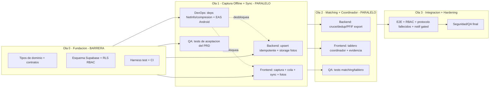

# Roadmap de Ejecución + Orquestación Multi-Agente — Módulo Reencuentro

> Cómo pasamos del plan a código **a toda máquina**, en paralelo, sin pisarnos, con TDD y ramas limpias.
> Contexto: emergencia activa — priorizar *time-to-usefulness*. Trabajo **coordinado con otros ingenieros humanos**.

| | |
|---|---|
| **Repo** | hu-amos-colombia (Hu-Mano Colombia · Expo/RN/Supabase) |
| **Rama base** | `main` (protegida — solo se integra por PR) |
| **Despliegue actual** | Android |
| **Autor** | PM/Orquestador (agente) · 2026-08-12 |

---

## 1. Principios de ejecución

1. **No romper la app existente** ("necesidades"): el módulo vive aislado en `src/features/reencuentro/` y su propio grupo de rutas.
2. **TDD obligatorio**: test que falla → implementación → refactor. Nada se integra sin tests verdes.
3. **PII-first**: datos de personas y menores exigen RBAC/RLS real. Prohibido reusar políticas públicas (`USING (true)`).
4. **Contratos primero**: front y back se desacoplan con interfaces (Ola 0) para poder paralelizar.
5. **Ramas cortas + PR**: nada se commitea a `main`. Cada tarea, su rama; cada agente, su worktree.
6. **Índice de código fresco** antes de cada ola/loop (codebase memory) — ver §4.
7. **Propiedad de archivos** clara para evitar conflictos de escritura en paralelo — ver §5.

---

## 2. Estrategia de ramas Git

```
main                      (protegida, PR-only)
 └─ feat/reencuentro-planning     ← docs/specs (esta y las demás .md)
 └─ feat/reencuentro-foundation   ← Ola 0 (tipos, esquema, harness, contratos)
 └─ feat/reencuentro-offline-capture   ← Ola 1 frontend (PRD captura+sync)
 └─ feat/reencuentro-backend-sync       ← Ola 1 backend (upsert idempotente, storage)
 └─ feat/reencuentro-devops-ci          ← Ola 1 infra (CI, deps, EAS Android)
 └─ feat/reencuentro-matching           ← Ola 2 backend (cruce/dedup/PFIF)
 └─ feat/reencuentro-coordinator        ← Ola 2 frontend (tablero)
 └─ feat/reencuentro-integration        ← Ola 3 (e2e, RBAC, protocolo fallecidos)
```

**Reglas:**
- Prefijos: `feat/`, `fix/`, `chore/`, `test/`, `docs/`.
- **Commits convencionales**: `feat(reencuentro): ...`, `test(reencuentro): ...`. Cada commit cierra en verde (lint+typecheck+test).
- Cada rama de agente se abre **desde la rama de su ola** (o desde `main` si la ola ya integró), no desde otra rama de agente.
- **Aislamiento por worktree**: cada agente corre en su propio `git worktree` para no chocar en el árbol de trabajo.
- Integración: PR → CI verde → merge a la rama de ola → cuando la ola cumple *exit criteria*, PR de la ola a `main`.
- **Un agente NO edita archivos fuera de su partición** (§5). Si necesita un cambio en zona ajena, lo pide vía contrato/PR, no lo toca.

---

## 3. Reglas de desarrollo (Definition of Done)

Una tarea está **Done** cuando:
- [ ] Tests escritos **antes** (TDD) y **verdes**; cubren happy path + edge cases del PRD.
- [ ] `npm run typecheck` (tsc --noEmit) sin errores; sin `any` nuevos.
- [ ] Lint verde; sin `console.log` en código de producción (usar un logger).
- [ ] Cobertura del código nuevo **≥ 80%**.
- [ ] **No rompe** la app de necesidades (suite de regresión verde).
- [ ] Sin credenciales/secretos hardcodeados; PII de menores marcada sensible.
- [ ] Texto de UI en **español**; reutiliza `theme.ts` (nada de colores sueltos).
- [ ] Reutiliza lo existente antes de crear nuevo (ver §5.1 puntos de reutilización).
- [ ] PR con descripción, criterios de aceptación marcados y diffs acotados a su partición.

**Stack de test (Ola 0 lo instala):** `jest-expo` + `@testing-library/react-native` + `@testing-library/jest-native`; para lógica pura, Jest plano. Mocks de `@react-native-async-storage/async-storage` y del cliente Supabase.

---

## 4. Regla de Codebase Memory (índice de código)

**Obligatorio antes de lanzar cualquier ola, loop o batch de agentes**, y después de cada merge de ola.

**Binario:** `codebase-memory-mcp` (v0.8.1). En Windows/PowerShell invocar el `.exe` real con comillas escapadas (el shim `.cmd` rompe el JSON):

```powershell
$cbm = "C:\Users\Usuario\AppData\Roaming\npm\node_modules\codebase-memory-mcp\bin\codebase-memory-mcp.exe"

# (Re)indexar todo el repo — antes de cada ola/loop
& $cbm cli index_repository '{\"repo_path\":\"C:/Users/Usuario/Documents/github/works/hu-amos-colombia\"}'

# Indexar solo cambios (incremental, más rápido) — entre tareas
& $cbm cli detect_changes '{\"repo_path\":\"C:/Users/Usuario/Documents/github/works/hu-amos-colombia\"}'
```

**Ciclo:**
1. **Antes de una ola/loop** → `index_repository` (grafo fresco).
2. **Cada agente al iniciar** → consulta el grafo para reutilizar en vez de reimplementar:
   - `search_code '{\"query\":\"AsyncStorage queue\"}'`
   - `get_architecture '{}'`
   - `search_graph '{\"name_pattern\":\".*Supabase.*\"}'`
3. **Después de cada merge de ola** → reindexar para que la siguiente ola vea el código nuevo.

> Regla dura: **ningún loop agentico arranca sin reindexar primero.** El PM/Orquestador lo ejecuta y lo deja registrado en el reporte de la ola.

---

## 5. Mapa de propiedad de archivos (evita conflictos en paralelo)

| Zona | Dueño | Notas |
|---|---|---|
| `src/features/reencuentro/domain/` (tipos, contratos) | **Ola 0** (congelado tras Ola 0) | Cambios posteriores solo por PR coordinado |
| `supabase/migrations/`, `supabase/functions/` | **Backend** | Esquema, RLS/RBAC, RPC, Edge Functions |
| `src/features/reencuentro/services/` (repos, sync, api client) | **Frontend** | Implementa contratos de dominio |
| `src/features/reencuentro/ui/`, `app/(reencuentro)/` o `app/(tabs)/reencuentro*` | **Frontend** | Pantallas y componentes (reusa `theme.ts`) |
| `.github/workflows/`, `jest.config.js`, `jest.setup.ts`, `package.json` (deps) | **DevOps** | CI, harness, dependencias, EAS Android |
| `src/features/reencuentro/__tests__/acceptance/` | **QA** | Tests de aceptación derivados del PRD |
| `docs/producto/` | **PM** | Specs |

### 5.1 Puntos de reutilización obligatorios (no reinventar)
- Persistencia local: patrón `safeAsyncStorage` de `src/services/storage.ts` (guards SSR, key versionada).
- Cliente Supabase: `supabase` + `isSupabaseConfigured()` de `src/lib/supabase.ts`.
- Identidad/rol: `AuthContext` (`src/context/AuthContext.tsx`) — **extender** con rol (familiar/socorrista/hospital/albergue/coordinador).
- Notificaciones: `src/services/pushNotifications.ts` + tabla `user_push_tokens` (gatilladas solo tras confirmación humana — Ola 3).
- Estética: `src/constants/theme.ts`, `formatWhatsAppNumber`, `getTimeAgo`.

---

## 6. Roadmap por olas (con DAG de dependencias)



### Reglas de dependencia (qué desbloquea qué)
| Para empezar… | …debe estar listo |
|---|---|
| Cualquier cosa de Ola 1 | Ola 0 completa (tipos + esquema + contratos + harness) |
| Frontend/Backend Ola 1 en TDD | Contratos de dominio (mocks disponibles) — pueden correr **contra mocks** aunque el otro lado no exista aún |
| Ola 2 (matching) | Reportes ya sincronizan a Supabase (Ola 1 backend) |
| Ola 2 (tablero) | Tipos de `Coincidencia` (Ola 0) + datos de reportes (Ola 1) |
| Ola 3 | Olas 1 y 2 integradas |

### Exit criteria por ola
- **Ola 0:** compila; migración aplica en Supabase local; `npm test` corre (aunque haya 1 test dummy verde); contratos + mocks publicados.
- **Ola 1:** criterios de aceptación del PRD captura+sync verdes; captura 100% offline en Android; sync idempotente demostrada; 0 regresiones.
- **Ola 2:** cruce produce coincidencias con banda+evidencia; dedup sugiere fusiones; export PFIF válido.
- **Ola 3:** e2e familiar→socorrista→coordinador; RBAC aplicado; protocolo fallecidos bloquea notificación automática; 0 P0.

---

## 7. Definición de agentes (specs directos)

Cada agente: **una partición, una rama, worktree propio, TDD**. Consulta el índice antes de escribir.

### 🟦 Agente Backend (Supabase)
- **Owns:** `supabase/migrations/`, `supabase/functions/`.
- **Ola 0:** tablas `personas_reportes` (esquema único, `tipo`, `estado_vital`, `sync_state`, `es_menor`, campos PFIF), `coincidencias`, `roles_usuario`; **RLS con RBAC real** (lectura/escritura por rol; menores restringidos); índices para cruce (`unaccent`, `pg_trgm`).
- **Ola 1:** RPC/Edge Function de **upsert idempotente por id de cliente**; bucket de fotos con política RBAC; tests de RLS (un rol no puede leer lo que no debe).
- **Ola 2:** función de cruce (similitud fonética ES + edad±tol + geo), dedup, export PFIF.
- **DoD extra:** cada policy RLS tiene test que prueba acceso permitido **y denegado**.
- **Reglas:** ningún `USING (true)` en tablas con PII. Nada de secretos en el repo.

### 🟩 Agente Frontend (React Native / Expo)
- **Owns:** `src/features/reencuentro/services/`, `src/features/reencuentro/ui/`, rutas `app/(tabs)/reencuentro*`.
- **Ola 1 (PRD captura+sync):** formularios BUSCADA/ENCONTRADA; `SyncQueue` durable (patrón `safeAsyncStorage`/SQLite); motor de sync (disparos: NetInfo, foreground, manual); compresión de foto; estados Pendiente/Sincronizando/Sincronizado/Error; pantalla "Mis reportes".
- **Ola 2:** tablero del coordinador (cola por banda, evidencia, confirmar/rechazar/pedir info).
- **DoD extra:** corre **contra mocks** de los contratos (no espera al backend); reusa `theme.ts` y `AuthContext`.
- **Reglas:** captura nunca bloquea por red; textos en español; foto opcional.

### 🟨 Agente DevOps / Infra
- **Owns:** `.github/workflows/`, `jest.config.js`, `jest.setup.ts`, deps en `package.json`, config EAS Android.
- **Ola 0/1:** harness de test (jest-expo + testing-library + mocks); pipeline CI (lint + typecheck + test + cobertura) que corre en cada PR; añadir deps (`netinfo`, `expo-image-manipulator`, `uuid`); perfil de build **Android** (EAS o local); script `npm run typecheck`.
- **DoD extra:** CI **bloquea** merge si algo está rojo; caché de deps para velocidad.
- **Reglas:** no toca código de feature; solo infra y configuración compartida.

### 🟥 Agente QA / Test
- **Owns:** `src/features/reencuentro/__tests__/acceptance/`.
- **Trabajo:** convierte los criterios de aceptación del PRD en tests ejecutables (pueden escribirse **en paralelo** contra los contratos/mocks desde Ola 0). Tests de kill/restore de la cola, idempotencia de sync, RLS denegado, regresión de la app de necesidades.
- **DoD extra:** cada criterio de aceptación del PRD tiene ≥1 test asociado y trazable.

### 🟪 Agente Integrador / Revisor (Ola 3, y verificación por ola)
- **Trabajo:** integra ramas, corre e2e, verifica RBAC y el **protocolo de fallecidos** (la app no notifica), y revisa adversarialmente (¿algún camino notifica sin confirmación humana? ¿algún dato de menor se filtra?). Reporta hallazgos, no mergea en rojo.

---

## 8. Reglas de paralelización

- **Barrera dura:** Ola 0 debe cerrar antes de abrir Ola 1 (todos dependen de tipos/esquema/harness).
- **Dentro de una ola:** Backend, Frontend, DevOps y QA corren **en paralelo** contra contratos/mocks (worktrees separados, particiones disjuntas).
- **Entre olas:** barrera + reindexado del código antes de la siguiente.
- **Anti-conflicto:** particiones de archivos disjuntas (§5); si dos necesitan el mismo archivo → es señal de que falta un contrato en Ola 0.
- **Nada de silencios:** si un agente recorta alcance (mock en vez de real, sin cierto edge case), lo reporta explícito.

---

## 9. Supervisión y reporte (mi rol como orquestador)

- Antes de cada ola: **reindexo** (codebase memory) y confirmo exit criteria de la ola previa.
- Lanzo los agentes de la ola (worktree, TDD), **superviso** ejecución y **corro los tests** al integrar.
- Te **reporto por ola**: qué quedó verde, qué falló, blockers, decisiones que necesito de ti, y el diff/ramas.
- En **modo /loop o goal**: cada iteración = una tarea/ola; reindexo al inicio de cada iteración; me detengo y te consulto ante decisiones no reversibles (RLS de PII, protocolo de fallecidos, algo que toque la app existente).

---

## 10. Riesgos de la orquestación

| Riesgo | Mitigación |
|---|---|
| Agentes en paralelo pisan archivos | Particiones disjuntas + worktrees + contratos en Ola 0 |
| Deriva de contrato (front/back divergen) | Tipos de dominio congelados tras Ola 0; cambios por PR coordinado |
| Reintroducir RLS público / secretos | Regla dura + tests de RLS denegado + revisión del Integrador |
| Romper la app de necesidades | Suite de regresión en CI; módulo aislado |
| "Verde falso" (tests que no prueban nada) | Revisor adversarial por ola; cobertura + criterios trazables al PRD |
| Coordinación con ingenieros humanos | Ramas/PR claros, particiones publicadas, nada directo a `main` |

---

## 11. Estado actual y siguiente paso

### Decisiones resueltas (2026-08-12)
- **Modelo de auth (RBAC):** captura pública anónima/invitado para **familiar** y **socorrista** (cero fricción en emergencia); **auth verificada obligatoria** para roles privilegiados (**coordinador, hospital, albergue**). El RLS del backend se diseña sobre esta base.
- **Protocolo de fallecidos:** **stub documentado** — la app bloquea la notificación automática y enruta a "protocolo oficial"; se cablea el lineamiento real de UNGRD / Cruz Roja / Medicina Legal cuando esté disponible.

### Progreso (Ola 0 — parcial, en `feat/reencuentro-foundation`)
- ✅ Capa de dominio: tipos, contratos, mocks, máquinas de estado (con reglas duras de fallecidos).
- ✅ Harness de test (jest-expo) + scripts `test` / `typecheck`.
- ✅ Motor de sync idempotente (aislamiento de fallos + backoff). **19 tests verdes**, typecheck limpio.
- ⏳ Pendiente de Ola 0: esquema Supabase + RLS/RBAC (backend) — arranca con el modelo de auth ya decidido.

### Siguiente
- **Backend Ola 0:** `personas_reportes` + `coincidencias` + `roles_usuario` con **RLS RBAC real** (anónimo solo captura; roles privilegiados con auth verificada).
- **Luego Ola 1:** persistencia real (AsyncStorage/SQLite) + NetInfo + compresión de foto + UI de captura, todo con TDD contra los contratos ya definidos.
